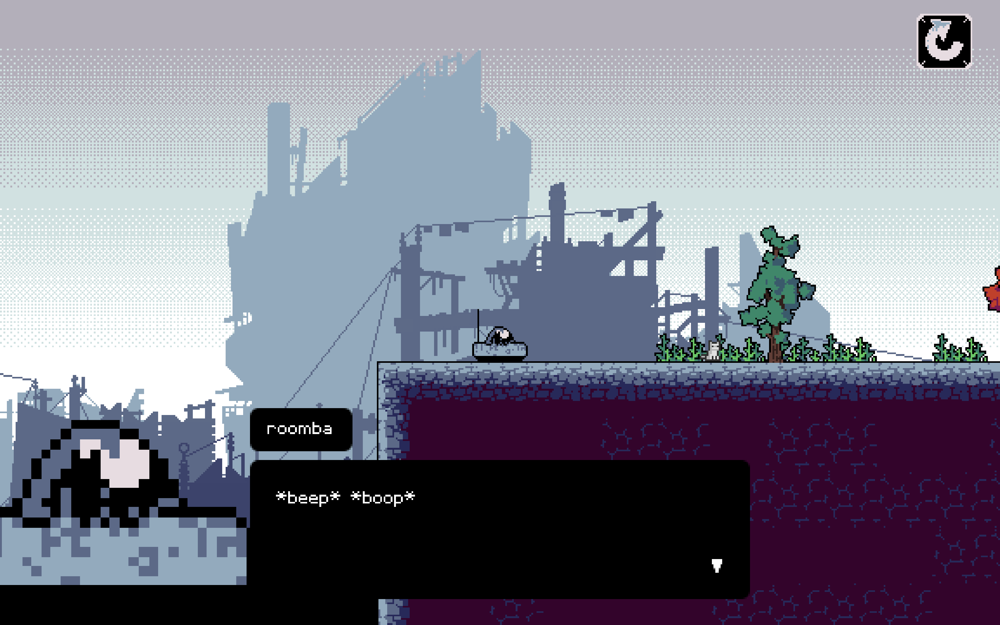
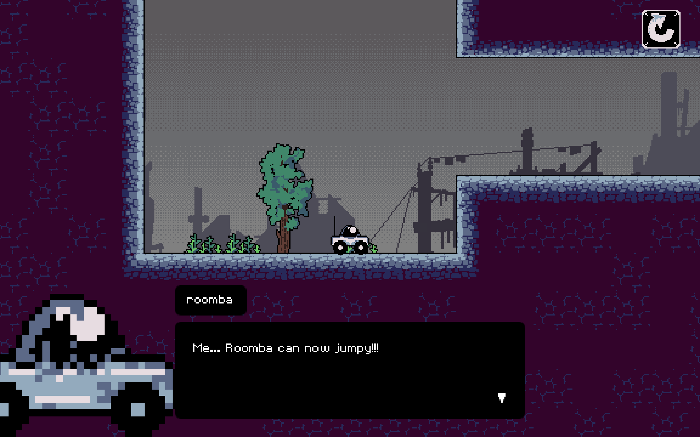
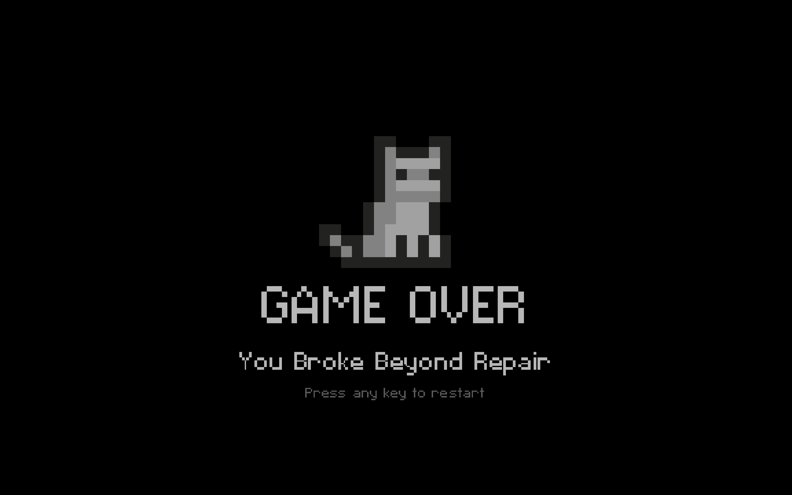

# 🎮 BitFlip

**Link to Game:** [https://zkio.itch.io/bitflip](https://zkio.itch.io/bitflip)

---

## 🧠 Overview

_In the distant future, few creatures remain._

You wake up as a broken robot—your memories fragmented, your purpose unclear. The only thing that drives you forward is the sight of a lone cat, darting through the ruins. Instinct takes over—you must chase it. But as the pursuit intensifies, the world around you begins to whisper forgotten truths.

> **Will you fix yourself... or uncover a truth too devastating to fix?**

BitFlip is a narrative-rich 2D platformer with minimal UI, immersive storytelling, and an emotionally resonant twist. It challenges players not just with puzzles and platforming, but with existential choices embedded in level design.

---

## 🛠️ Development

- 🔧 **Engine:** Godot Engine (v3.5)
- 💻 **Language:** GDScript
- 🎨 **Assets:** Royalty-free sprite & environment packs from itch.io
- 🌍 **Level Design:** Built using modular scene components and custom scripts

---

## 🚀 Key Features

- 🐾 **Cat Companion AI** – Designed with movement to guide, driving story immersion.
- 🧠 **Environmental Storytelling** – The world speaks through visuals, pacing, and physics.
- 🧪 **FSM-driven Entity Behavior** – Custom finite state machines for player, and triggers.

---

## 🧑‍💻 Technical Highlights

| Feature                     | Description                                                                 |
|----------------------------|-----------------------------------------------------------------------------|
| Modular Scene Architecture | Reusable object and tile scenes for rapid level development                |
| Custom Physics Layers      | Enable interaction between selective game elements and logic zones         |
| FSM-based AI               | Lightweight state machines manage cat behavior                   |
| Signal-based Triggers      | Clean event-driven gameplay logic using Godot’s signal system              |
| Optimized for 72hr Jam     | Built under tight time constraints without sacrificing quality             |

---

## 🏆 Achievements

- 🥇 **1st Prize Winner** – *GameJam, Adivitya 2025 @ IIT Ropar*
- ⚡ Developed in **under 72 hours** by a team of 3

---

## 📸 Screenshots
 
  
 

---

## 👥 Team BitFlip

- 🎮 **Manish Kumar Gupta** – Game Design, Level Development, Difficulty Balancing  
- 🎨 **Mohammad Shahnawaz Khan** – Pixel Art, Asset Integration  
- 🧠 **Aditya Nandan** – Scripting, Logic Systems, AI Design

---

## 🚧 Future Roadmap

- 📱 Web & Android Build Support
- 🧩 New mechanics: gravity inversion, memory echo puzzles
- 💾 Save/load functionality and chapter selector
- 🧠 AI evolution: more responsive companion/enemy behaviors
- 📖 Optional lore collectibles and branching story arcs

---

> “BitFlip isn’t just a platformer. It’s a broken memory... stitched together by instinct, emotion, and a cat that just won’t stop running.”
